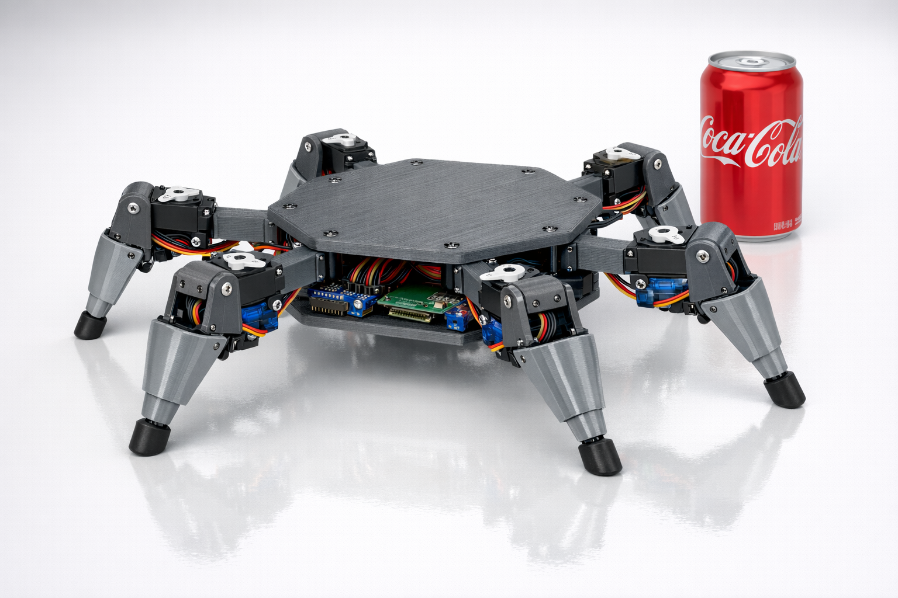

# Hexapod Robot



A 3DOF hexapod walking robot with 18 servos, 3D-printed frame, and Python control software.

## Specifications

| Spec | Value |
|------|-------|
| Legs | 6 |
| DOF per leg | 3 (coxa, femur, tibia) |
| Total servos | 18 |
| Body size | ~200-250mm across |
| Leg reach | ~150mm from body center |
| Gait types | Tripod, wave, ripple |

## Hardware

- **12x SG90 + 6x MG90S** - Servos (MG90S metal gear for femur joints)
- **2x PCA9685** - 16-channel PWM drivers (I2C)
- **ESP32 WROOM-32** - Main real-time controller
- **Raspberry Pi Zero 2W** - Optional, for camera/vision
- **3S Li-Ion battery** - 11.1V, 1.3-3.5Ah
- **2x 5V 5A UBEC** - Servo power distribution

## Leg Geometry

```
     FRONT
  L1       R1
    \     /
     \   /
  L2--[B]--R2
     /   \
    /     \
  L3       R3
     REAR
```

Each leg has 3 joints:
- **Coxa** (25mm) - Hip rotation (horizontal)
- **Femur** (55mm) - Upper leg lift (vertical)
- **Tibia** (75mm) - Lower leg extension (vertical)

## Project Structure

```
hexapod/
├── hex/
│   ├── cad/              # OpenSCAD parametric designs
│   │   ├── leg.scad      # Leg components
│   │   └── test_leg.scad # Test assembly
│   ├── src/              # Python control software
│   │   ├── esp32_main.py # ESP32 controller (MicroPython)
│   │   ├── zero_main.py  # Pi Zero controller (optional, camera)
│   │   ├── hexapod.py    # Hexapod class + IK
│   │   ├── gait.py       # Gait patterns
│   │   ├── pca9685.py    # PWM driver
│   │   └── calibrate.py  # Servo calibration
│   └── PLAN.md           # Detailed project plan
├── WIRING.md             # Wiring diagram
├── PURCHASED             # Ordered parts
└── PRINT_QUEUE.md        # 3D print tracking
```

## Features

- **Inverse Kinematics** - Converts foot position (x, y, z) to servo angles
- **Multiple Gaits** - Tripod (fast), wave (stable), ripple (smooth)
- **Servo Calibration** - Per-servo min/max/center adjustment
- **Simulation Mode** - Test without hardware
- **Dual PCA9685 Support** - 32 PWM channels via I2C

## Getting Started

1. Print the leg components from `hex/cad/`
2. Wire servos to PCA9685 boards per the channel mapping in `hex/PLAN.md`
3. Install dependencies:
   ```bash
   pip install adafruit-circuitpython-pca9685
   ```
4. Run calibration:
   ```bash
   python hex/src/calibrate.py
   ```
5. Test with simulation:
   ```bash
   python hex/src/hexapod.py --simulate
   ```

## License

MIT
